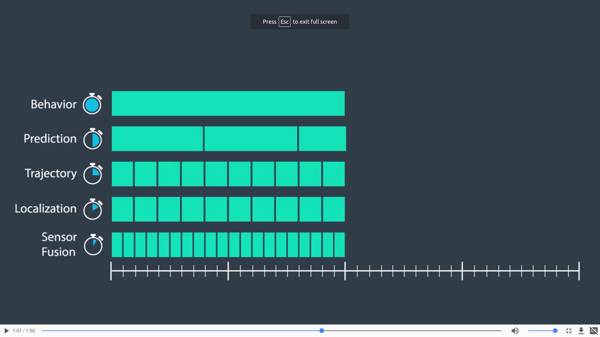

# CarND-Path-Planning-Project
Self-Driving Car Engineer Nanodegree Program

## Summary

The codes meet requirements of path planning projects rubrics.
1. The code compiles correctly.
2. The car is able to drive at least 4.32 miles without incident.
3. The car drives below speed limit.
4. Max acceleration and jerk do not exceed limit 10m/s^2 and 10m/s^3.
5. There are not collisions.
6. The car stays in its lane, except for the time between changing lanes.
7. The car can change lanes according to traffic and sensor fusion.

A screen shot is attached here since video file is too big.


The codes also works well for Bosch challenge in about 202~250s, which depend on simulator random traffic situation.


## Prediction

All other vehicles path are predicted on the assumption that it goes straight without lane change. Details codes are shown below.
```
double vx = sensor_fusion[i][3];
double vy = sensor_fusion[i][4];		    
double check_speed = sqrt(vx*vx+vy*vy);
double check_car_s = sensor_fusion[i][5];
check_car_s += ((double)prev_size*0.02*check_speed);
```
During cost calculation, path length 50 is used to replace `prev_size`.
There are a lot of advantages to use predicted `s` in this project since initial `s`, velocity and acceleration have been considered.

The assumption works only for highway not for all traffic situation. In order to prevent collision caused by  the front car urgent lane change, it is necessary to detect cars on a wider lane.
```
// lane width
int LANE_WIDTH = 4;

// detect vehicles with consideration of +/- LANE*LANE_MARGIN = +/-2.4m
float LANE_MARGIN = 0.6;

float d = sf[i][6];
if(d < (LANE_WIDTH*(0.5+l+LANE_MARGIN)) && d > (LANE_WIDTH*(0.5+l-LANE_MARGIN)))
```
For ego car, `end_path_s` is used as estimated end way point with variable `lane`.
* If lane keep same, it means KL.
* `lane -= 1` means LCL.
* `lane += 1` means LCR.

In this case, there are at least three predicted trajectories to evaluate cost for ego car.

## Trajectory generation

Trajectory generation model is responsible to generate a real path which car will follow.

Spline is carried over from Q&A walkthrough video since it is very easy to use and control.

What we need to do is choose a best trajectory and then determine `lane`, then Spline will deal with the rest of job and provide what we want path points for simulator.

```
// create a spline
tk::spline s;
s.set_points(ptsx,ptsy);
```
```
if(LCL && (i_cycle % 4 == 0))
{
  lane -=1;
  std::cout << "lane change left: cost of LCL, KL, LCR:" << cost_LCL << "  "<< cost_KL << "  " << cost_LCR << std::endl;
}else if(LCR && (i_cycle % 4 == 0))
{
  lane +=1;
  std::cout << "lane change right: cost of LCL, KL, LCR:" << cost_LCL << "  "<< cost_KL << "  " << cost_LCR << std::endl;
}
```

Details Spline please see [Spline](http://kluge.in-chemnitz.de/opensource/spline/)

## Behavior planner

The behavior planner's task is to get best behavior for the next step, KL, LCL or LCR.

The trigger for behavior planner is when ego car detect there are a vehicle in front and within a specified distance. Then the behavior planner will determine possible behaviors according to current lane, calculate all possible behaviors' cost and choose the best one to trajectory generation.  

```
if((check_car_s > car_s) &&((check_car_s-car_s) <= DIST_REF))
{
// behavior_planner model to determine
// LCL / LCR / KL
// +/- velocity
// +/- acceleration
// calcuate cost of possible behaviors according to current lane
  if(lane == 0)
	{
    cost_LCL = 999;
		cost_KL = calculateCost(car_s, lane, sensor_fusion, false);
		cost_LCR = calculateCost(car_s, (lane+1), sensor_fusion, true);
		cost_LCRR = calculateCost(car_s, (lane+2), sensor_fusion, true);
	}else if(lane == 1)
	{
		cost_LCL = calculateCost(car_s, (lane-1), sensor_fusion, true);
		cost_KL  = calculateCost(car_s, lane, sensor_fusion, false);
		cost_LCR = calculateCost(car_s, (lane+1), sensor_fusion, true);
	}else if(lane == 2)
	{
	  cost_LCL = calculateCost(car_s, (lane-2), sensor_fusion, true);
		cost_LCL = calculateCost(car_s, (lane-1), sensor_fusion, true);
		cost_KL  = calculateCost(car_s, lane, sensor_fusion, false);
		cost_LCR = 999;
	}
}
```
If the car is the leftmost lane, the lane id 2 cost is also evaluated. In this case, the car will be smart to find the best lane from all three lanes.

If the cost of LCLL or LCRR is the lowest, it means the car should go to the leftmost or rightmost lane even there a lane between car and the leftmost or rightmost lane. Before deciding LCL or LCR accoridng to LCLL and LCRR cost values, it is necessary to evaluate the cost of LCL and LCR first. If there are possibility collision on LCL and LCR, it should give up lane change and keep lane.

```
if(cost_LCLL < cost_LCL && cost_LCL < .3*WEIGHT_SAFETY)
{
  cost_LCL = cost_LCLL;
}
if(cost_LCRR < cost_LCR && cost_LCR < .3*WEIGHT_SAFETY)
{
 	cost_LCR = cost_LCRR;
}
```
Three flag variables to indicate final best behavior in this codes.
`bool KL`, `bool LCL` and `bool LCR`.

## Cost function design

There are two kind of cost function in this projects.
* efficiency cost function

Efficiency cost function look more far away to detect traffic condition on highway and return range 0~1 efficiency cost value which multiplied with `WIGHT_EFFICIENCY 1.0`.

* safety cost function

Safety cost function care for more about the possibilities of collision both front and rear. The input are same to efficiency cost but with different cost function design and multiplied with `WEIGHT_SAFETY 100`.

All cost functions are shown below.


The rear collision cost is only calculated if change lane.

The front collision cost value is also to determine the minimum gap between ego car and the front car. If the gap is too close the code will turn on `flag_reduce_acc` to help decrease car speed soon.

```
// determine best behavior according to the min cost
if(cost_KL <= cost_LCL && cost_KL <= cost_LCR)
{
  KL = true;
	LCL = false;
	LCR = false;
	flag_reduce_vel = true;
  if(cost_KL >1.5*WEIGHT_SAFETY)
  {
    flag_reduce_acc = true;
  }
}
```

```
// increase a or decrease a
if(flag_increase_acc or vel < 0.5*TARGET_SPEED)
{
  vel += DELTA_VEL;
}		
if(flag_reduce_acc)
{
  vel -= DELTA_VEL*2;
}
```

## Reflections

This is not a easy project.

At first I have not any idea to combine what we learn in class and the project. Thanks for the walkthrough video a lot.

The first step is to control the car with a simple codes, which principle is same to what the people drive on the highway. It works well but there are a lot of special situation the code can do deal with and not easy to improve.

Then I modified the codes to cost function structure and test it, tuning it and improve it one by one.

The distance of estimated end path points is used first as input of cost function. In this case, the reference distance to tell collision possibility can not balance the high speed and low speed.

Finally a relative difference of time is used as input of cost functions.

```
return minGap/(50*0.02*minVel);   
// realative to 1s check car displacement. return value is a relative value.
```  

###  The maximum acceleration

According to project information, the requried Max. acceleration 10m/s^2, the cycyle iterval is 0.02s.

So the maximum speed difference should be 0.2m/s for each cycle.

Finally 0.33m/s is used in the codes after tuning. The reason is mainly for the simualator calcuate acceleration method.  
```
// delta velocity
float DELTA_VEL = 0.33; // m/s
```

### To monitor all three lanes even the car on the leftmost or rightmost lane

At first the codes only evaluate the adjacent lanes and make decision.

As mentioned above, the car will be more smart and flexible after evaluating all three lanes together and make decision.

### How to avoid continuous lane change

At first, the behavior planner always continuous lane change and lead to Max. acceleration and Max. Jerk above required limit.  

The reason for that is because the codes scheduling compute time is different with  class which is shown below. the codes determine behavior each 0.02s if triggered by the front car, in this case, it is very often to continuous lane change.


In order to prevent continuous lane change and keep Max. acceleration and Max. Jerk below limit, these following codes are added to make sure the adjacent lane change happens after at least 4 cycles.

```
if(LCL && (i_cycle % 4 == 0))
{
  lane -=1;
	std::cout << "lane change left: cost of LCL, KL, LCR:" << cost_LCL << "  "<< cost_KL << "  " << cost_LCR << std::endl;
}else if(LCR && (i_cycle % 4 == 0))
{
	lane +=1;
	std::cout << "lane change right: cost of LCL, KL, LCR:" << cost_LCL << "  "<< cost_KL << "  " << cost_LCR << std::endl;
}
```
### Switch from Udacity and Bosch simulator

```
// Waypoint map to read from
string map_file_ = "../data/highway_map.csv";
//string map_file_ = "../data/highway_map_bosch1.csv";
// The max s value before wrapping around the track back to 0
double max_s = 6945.554;
//double max_s = 5104.621;
```

### What the code can not to do now

Even though the codes works well in Udacity and Bosch challenge simulator, there are a lot of improvements what we can in the future.

For example, the codes can not make decision that first slow down and then lane change to the empty lane in this following situation shown below.


### Simulator. You can download the Term3 Simulator BETA which contains the Path Planning Project from the [releases tab](https://github.com/udacity/self-driving-car-sim/releases).

In this project your goal is to safely navigate around a virtual highway with other traffic that is driving +-10 MPH of the 50 MPH speed limit. You will be provided the car's localization and sensor fusion data, there is also a sparse map list of waypoints around the highway. The car should try to go as close as possible to the 50 MPH speed limit, which means passing slower traffic when possible, note that other cars will try to change lanes too. The car should avoid hitting other cars at all cost as well as driving inside of the marked road lanes at all times, unless going from one lane to another. The car should be able to make one complete loop around the 6946m highway. Since the car is trying to go 50 MPH, it should take a little over 5 minutes to complete 1 loop. Also the car should not experience total acceleration over 10 m/s^2 and jerk that is greater than 50 m/s^3.

#### The map of the highway is in data/highway_map.txt
Each waypoint in the list contains  [x,y,s,dx,dy] values. x and y are the waypoint's map coordinate position, the s value is the distance along the road to get to that waypoint in meters, the dx and dy values define the unit normal vector pointing outward of the highway loop.

The highway's waypoints loop around so the frenet s value, distance along the road, goes from 0 to 6945.554.

## Basic Build Instructions

1. Clone this repo.
2. Make a build directory: `mkdir build && cd build`
3. Compile: `cmake .. && make`
4. Run it: `./path_planning`.

Here is the data provided from the Simulator to the C++ Program

#### Main car's localization Data (No Noise)

["x"] The car's x position in map coordinates

["y"] The car's y position in map coordinates

["s"] The car's s position in frenet coordinates

["d"] The car's d position in frenet coordinates

["yaw"] The car's yaw angle in the map

["speed"] The car's speed in MPH

#### Previous path data given to the Planner

//Note: Return the previous list but with processed points removed, can be a nice tool to show how far along
the path has processed since last time.

["previous_path_x"] The previous list of x points previously given to the simulator

["previous_path_y"] The previous list of y points previously given to the simulator

#### Previous path's end s and d values

["end_path_s"] The previous list's last point's frenet s value

["end_path_d"] The previous list's last point's frenet d value

#### Sensor Fusion Data, a list of all other car's attributes on the same side of the road. (No Noise)

["sensor_fusion"] A 2d vector of cars and then that car's [car's unique ID, car's x position in map coordinates, car's y position in map coordinates, car's x velocity in m/s, car's y velocity in m/s, car's s position in frenet coordinates, car's d position in frenet coordinates.

## Details

1. The car uses a perfect controller and will visit every (x,y) point it recieves in the list every .02 seconds. The units for the (x,y) points are in meters and the spacing of the points determines the speed of the car. The vector going from a point to the next point in the list dictates the angle of the car. Acceleration both in the tangential and normal directions is measured along with the jerk, the rate of change of total Acceleration. The (x,y) point paths that the planner recieves should not have a total acceleration that goes over 10 m/s^2, also the jerk should not go over 50 m/s^3. (NOTE: As this is BETA, these requirements might change. Also currently jerk is over a .02 second interval, it would probably be better to average total acceleration over 1 second and measure jerk from that.

2. There will be some latency between the simulator running and the path planner returning a path, with optimized code usually its not very long maybe just 1-3 time steps. During this delay the simulator will continue using points that it was last given, because of this its a good idea to store the last points you have used so you can have a smooth transition. previous_path_x, and previous_path_y can be helpful for this transition since they show the last points given to the simulator controller with the processed points already removed. You would either return a path that extends this previous path or make sure to create a new path that has a smooth transition with this last path.

## Tips

A really helpful resource for doing this project and creating smooth trajectories was using http://kluge.in-chemnitz.de/opensource/spline/, the spline function is in a single hearder file is really easy to use.

---

## Dependencies

* cmake >= 3.5
 * All OSes: [click here for installation instructions](https://cmake.org/install/)
* make >= 4.1
  * Linux: make is installed by default on most Linux distros
  * Mac: [install Xcode command line tools to get make](https://developer.apple.com/xcode/features/)
  * Windows: [Click here for installation instructions](http://gnuwin32.sourceforge.net/packages/make.htm)
* gcc/g++ >= 5.4
  * Linux: gcc / g++ is installed by default on most Linux distros
  * Mac: same deal as make - [install Xcode command line tools]((https://developer.apple.com/xcode/features/)
  * Windows: recommend using [MinGW](http://www.mingw.org/)
* [uWebSockets](https://github.com/uWebSockets/uWebSockets)
  * Run either `install-mac.sh` or `install-ubuntu.sh`.
  * If you install from source, checkout to commit `e94b6e1`, i.e.
    ```
    git clone https://github.com/uWebSockets/uWebSockets
    cd uWebSockets
    git checkout e94b6e1
    ```

## Editor Settings

We've purposefully kept editor configuration files out of this repo in order to
keep it as simple and environment agnostic as possible. However, we recommend
using the following settings:

* indent using spaces
* set tab width to 2 spaces (keeps the matrices in source code aligned)

## Code Style

Please (do your best to) stick to [Google's C++ style guide](https://google.github.io/styleguide/cppguide.html).

## Project Instructions and Rubric

Note: regardless of the changes you make, your project must be buildable using
cmake and make!


## Call for IDE Profiles Pull Requests

Help your fellow students!

We decided to create Makefiles with cmake to keep this project as platform
agnostic as possible. Similarly, we omitted IDE profiles in order to ensure
that students don't feel pressured to use one IDE or another.

However! I'd love to help people get up and running with their IDEs of choice.
If you've created a profile for an IDE that you think other students would
appreciate, we'd love to have you add the requisite profile files and
instructions to ide_profiles/. For example if you wanted to add a VS Code
profile, you'd add:

* /ide_profiles/vscode/.vscode
* /ide_profiles/vscode/README.md

The README should explain what the profile does, how to take advantage of it,
and how to install it.

Frankly, I've never been involved in a project with multiple IDE profiles
before. I believe the best way to handle this would be to keep them out of the
repo root to avoid clutter. My expectation is that most profiles will include
instructions to copy files to a new location to get picked up by the IDE, but
that's just a guess.

One last note here: regardless of the IDE used, every submitted project must
still be compilable with cmake and make./
